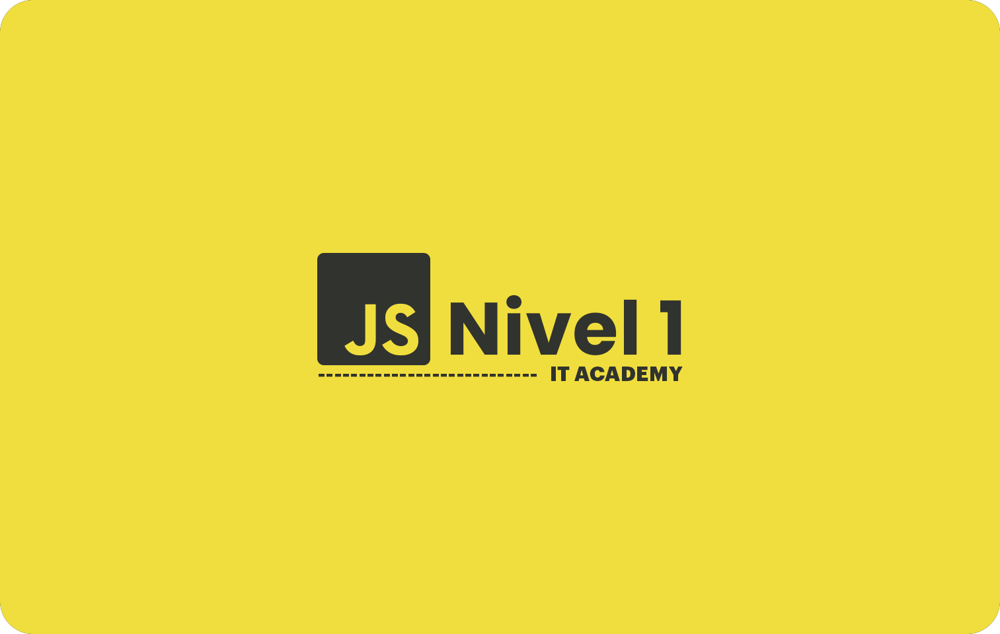

# IT Academy Specialization [ Sprint 02 ]

## Description

Welcome to Sprint 02 of the IT Academy Specialization!

In this Sprint, we will embark on a journey into the world of javascript. First we will do a basic review of what we studied in the previous course and we will progressively advance the level of difficulty.

## Features

- **Javascript:** Sprint 02 focuses on improving your JavaScript skills.

- **PicoCSS:** Working with Pico v2.0. Pico v2.0 features better accessibility, easier customization with SASS, a complete color palette, and a new group component.

- **Hands-On Learning:** Immerse yourself in practical exercises that provide a hands-on approach to web layout design. These exercises enable you to immediately apply the concepts you've learned.

## Technologies Used

Throughout this project, you'll be working with the following fundamental technologies:

- **HTML5:** HTML5 provides the basis for organizing web content and ensuring compatibility across devices.

- **CSS3:** CSS3 allows you to apply styles and visual enhancements to your web layouts, fostering creativity and design consistency.

- **JavaScript:** JavaScript adds dynamic and interactive elements to your project, enhancing the user experience and enabling more advanced functionalities.

- **PicoCSS v2:** PicoCSS v2 is a lightweight CSS framework that simplifies styling and layout tasks, making it easier to create responsive and visually appealing web designs.

- **Design Tools:** Work with design tools such as Figma and Photoshop to bring your layouts to life.

- **Code Editor:** Learn the efficient use of a code editor, a core skill for web development, to write, edit, and organize your projects.

## Badges/Shields

Dev Skills

CSS Framework

Build with

## Acknowledgments

Sprint 02 is made possible by the amazing IT Academy community and its vibrant Discord group.

## About Me

I'm a junior web developer with a passion for turning wireframes into beautiful web layouts. I'm here to share the knowledge I've gained with everyone who's on a similar journey.

## Contact

If you have any questions or suggestions, feel free to reach out to me via email: [codenaud@gmail.com](mailto:codenaud@gmail.com).

Happy coding! 🚀
